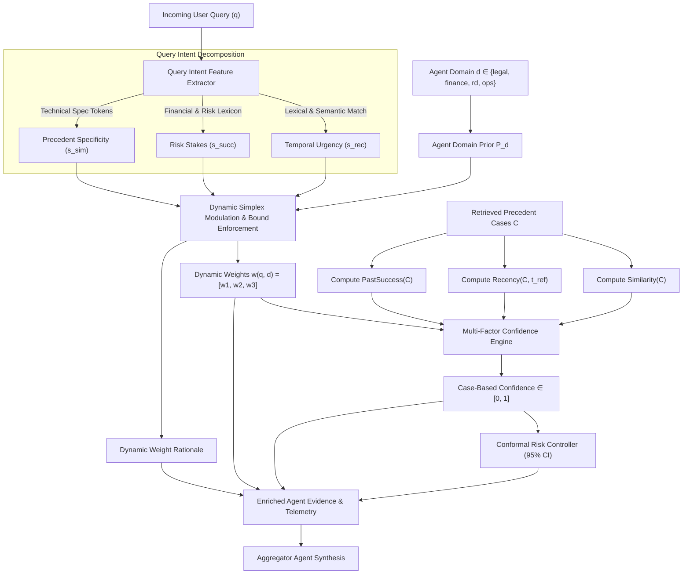

# Query-Adaptive Dynamic Weighting Engine: Architecture, Theory, and Implementation

## 1. Executive Summary & Problem Formulation

### 1.1 The Limitation of Precomputed Offline Weights
In early iterations of MARS, confidence scoring for Case-Based Reasoning (CBR) was governed by a static linear combination:
$$\text{Confidence} = w_1 \cdot \text{Similarity} + w_2 \cdot \text{Recency} + w_3 \cdot \text{PastSuccess}$$

The weight vector $\mathbf{w} = [w_1, w_2, w_3]$ was precomputed offline using a binary cross-entropy loss function over a calibration dataset (e.g., via grid search in `optimize_weights_from_outcomes`), yielding fixed snapshots such as $[0.45, 0.20, 0.35]$.

In practice, **static precomputed weights fail across real-world enterprise scenarios** for two primary reasons:
1. **Query-Blindness**: Queries exhibit completely different dimensional priorities:
   - A regulatory compliance query (e.g., *"Latest 2024 compliance regulations under the EU DMA"*) requires **Recency ($w_2$)** to dominate, as stale precedents may be legally invalid or dangerous.
   - A high-stakes capital allocation query (e.g., *"Should we commit $15B in capital expenditure for a new assembly plant?"*) requires **Past Success ($w_3$)** to dominate, as proven execution track records are paramount.
   - An architectural query (e.g., *"Exact INT8 quantization graph for Neural Engine CoreML"*) requires **Similarity ($w_1$)** to dominate, as exact technical analogy is essential.
2. **Agent-Blindness (Heterogeneous Mandates)**: Even for the **exact same query**, specialist agents possess fundamentally different operational mandates:
   - **Legal Agent**: Prioritizes regulatory freshness and statutory clause analogy.
   - **Finance Agent**: Prioritizes historical solvency, margins, and positive ROI outcomes.
   - **R&D Agent**: Prioritizes structural technical similarity and modern technological stack recency.
   - **Operations Agent**: Balances execution feasibility between workflow similarity and past operational reliability.

### 1.2 The Solution
We implemented a **Query-Adaptive Dynamic Weighting Engine** that calculates continuous, query-conditioned weights on the fly for each specialist agent:
$$\mathbf{w}(q, d) = [w_1(q, d), \, w_2(q, d), \, w_3(q, d)] = f(\text{Query } q, \, \text{Agent Domain } d)$$

All weights strictly preserve the simplex invariants ($\sum w_i = 1.0$ and $w_i \ge 0.10$), provide full runtime observability, and emit human-readable rationales.

---

## 2. End-to-End System Architecture



---

## 3. Mathematical Formulation

### 3.1 Confidence Scoring Function
For a query $q$, department agent $d$, and a set of retrieved historical cases $C = \{c_1, c_2, \dots, c_K\}$:
$$\text{Confidence}(q, d, C) = w_1(q, d) \cdot \text{Similarity}(C) + w_2(q, d) \cdot \text{Recency}(C) + w_3(q, d) \cdot \text{PastSuccess}(C)$$

Subject to the simplex constraints:
$$\sum_{i=1}^3 w_i(q, d) = 1.0, \quad \text{and} \quad w_i(q, d) \ge 0.10 \quad \forall i \in \{1, 2, 3\}$$

If no cases are retrieved ($C = \emptyset$) or average similarity $\text{Similarity}(C) \le 0.0$, the confidence is strictly:
$$\text{Confidence} = 0.0$$

---

### 3.2 Feature Value Formulations

#### 1. Precedent Similarity
Given pgvector cosine distances $d_k = 1 - \cos(\mathbf{e}_q, \mathbf{e}_{c_k})$:
$$\text{Similarity}(C) = \frac{1}{|C|} \sum_{c_k \in C} \left(1.0 - d_k\right) \in [0, 1]$$

#### 2. Temporal Recency with Exponential Decay
Let $t_k$ be the continuous quarter index ($t_k = \text{year} \times 4 + (\text{quarter} - 1)$) of case $c_k$, and $t_{\text{ref}}$ be the reference quarter:
$$\text{Recency}(C, t_{\text{ref}}) = \frac{1}{|C|} \sum_{c_k \in C} \exp\left(-\lambda \cdot \max(0, \, t_{\text{ref}} - t_k)\right)$$
where $\lambda = 0.05$ represents an empirical decay rate of $\approx 5\%$ per elapsed quarter.

#### 3. Empirical Past Success Rate
$$\text{PastSuccess}(C) = \frac{1}{|C|} \sum_{c_k \in C} \mathbb{I}\left(c_k.\text{outcome} \in \Omega_{\text{success}}\right)$$
where $\Omega_{\text{success}} = \{\text{"success"}, \text{"achieved"}, \text{"growth"}, \text{"approved"}, \text{"cleared"}\}$.

---

### 3.3 Dynamic Query-Conditioned Weight Modulation

#### Step 1: Agent Domain Priors $\mathbf{P}_d$
Each department has an organizational prior vector $\mathbf{P}_d = [p_{\text{sim}}, p_{\text{rec}}, p_{\text{succ}}]^T$:
$$\mathbf{P}_{\text{legal}} = \begin{bmatrix} 0.38 \\ 0.42 \\ 0.20 \end{bmatrix}, \quad \mathbf{P}_{\text{finance}} = \begin{bmatrix} 0.30 \\ 0.18 \\ 0.52 \end{bmatrix}, \quad \mathbf{P}_{\text{rd}} = \begin{bmatrix} 0.52 \\ 0.28 \\ 0.20 \end{bmatrix}, \quad \mathbf{P}_{\text{operations}} = \begin{bmatrix} 0.42 \\ 0.20 \\ 0.38 \end{bmatrix}, \quad \mathbf{P}_{\text{default}} = \begin{bmatrix} 0.40 \\ 0.25 \\ 0.35 \end{bmatrix}$$

#### Step 2: Query Intent Signal Extraction $\mathbf{S}(q)$
We compute a normalized 3-dimensional sensitivity vector $\mathbf{S}(q) = [s_{\text{sim}}, s_{\text{rec}}, s_{\text{succ}}]^T \in [0, 1]^3$:
$$s_i(q) = \frac{0.5 \cdot \text{LexicalScore}_i(q) + 0.5 \cdot \text{SemanticEmbeddingScore}_i(q)}{\sum_{j=1}^3 \left(0.5 \cdot \text{LexicalScore}_j(q) + 0.5 \cdot \text{SemanticEmbeddingScore}_j(q)\right)}$$

Where:
- $\text{LexicalScore}_{\text{rec}}(q)$: Matches temporal tokens (`2024`, `2025`, `2026`, `q1`-`q4`, `latest`, `recent`, `compliance`, `new`).
- $\text{LexicalScore}_{\text{succ}}(q)$: Matches risk and financial stakes tokens (`$`, `billion`, `capital`, `roi`, `margin`, `loss`, `shutdown`, `penalty`).
- $\text{LexicalScore}_{\text{sim}}(q)$: Matches technical and procedural tokens (`exact`, `quantization`, `code`, `architecture`, `step-by-step`, `clause`).
- $\text{SemanticEmbeddingScore}_i(q)$: Cosine similarity between query embedding $\mathbf{e}_q$ and intent centroid $\mathbf{c}_i$:
$$\text{SemanticEmbeddingScore}_i(q) = \max\left(0, \, \mathbf{e}_q \cdot \mathbf{c}_i\right)$$

#### Step 3: Mean-Centering & Relative Displacements
To ensure a neutral or balanced query does not distort base agent priors, signals are mean-centered:
$$\bar{s}(q) = \frac{1}{3}\sum_{i=1}^3 s_i(q)$$
$$\delta_i(q) = s_i(q) - \bar{s}(q) \quad \text{for } i \in \{\text{sim}, \text{rec}, \text{succ}\}$$

#### Step 4: Prior Modulation
$$\tilde{u}_i(q, d) = \mathbf{P}_{d, i} \cdot \left(1.0 + \gamma \cdot \delta_i(q)\right)$$
where $\gamma = 0.50$ is the current default sensitivity gain parameter.
This value is intentionally conservative: an `evaluation_v2` gain sweep found
that stronger modulation ($\gamma=0.85$) remained directionally useful but was
not the best setting for held-out NLL/ECE under the leakage-safe replay
protocol.

#### Step 5: Bound Enforcement & Simplex Normalization
To prevent any factor from being completely ignored or causing singular edge cases:
$$u_i(q, d) = \max\left(0.10, \, \tilde{u}_i(q, d)\right)$$
$$w_i(q, d) = \frac{u_i(q, d)}{\sum_{j=1}^3 u_j(q, d)}$$

By construction:
$$\sum_{i=1}^3 w_i(q, d) = 1.0 \quad \text{and} \quad w_i(q, d) \ge 0.10 \quad \forall i$$

---

## 4. Implementation Details in MARS Codebase

| Component | File Path | Key Functions / Responsibilities |
| :--- | :--- | :--- |
| **Dynamic Weighting Engine** | [`backend/app/reasoning/dynamic_weighting.py`](file:///Users/nitinreddy/Desktop/MARS/backend/app/reasoning/dynamic_weighting.py) | `QueryAdaptiveWeightEngine`, `compute_weights()`, `extract_query_signals()`. Computes dynamic weights and rationale. |
| **Confidence Engine** | [`backend/app/reasoning/confidence.py`](file:///Users/nitinreddy/Desktop/MARS/backend/app/reasoning/confidence.py) | `calculate_confidence()`, `calculate_confidence_with_details()`. Integrates dynamic weights with fallback to registry priors. |
| **Agent Pipeline** | [`backend/app/agents/common.py`](file:///Users/nitinreddy/Desktop/MARS/backend/app/agents/common.py) | `build_case_evidence()`. Accepts `query` and `department`, computes confidence, and enriches output dictionary. |
| **Specialist Agents** | [`finance_agent.py`](file:///Users/nitinreddy/Desktop/MARS/backend/app/agents/finance_agent.py), [`legal_agent.py`](file:///Users/nitinreddy/Desktop/MARS/backend/app/agents/legal_agent.py), [`rd_agent.py`](file:///Users/nitinreddy/Desktop/MARS/backend/app/agents/rd_agent.py), [`operations_agent.py`](file:///Users/nitinreddy/Desktop/MARS/backend/app/agents/operations_agent.py) | Forwards `query=query, department="..."` into `build_case_evidence`. |
| **Strategic Aggregator** | [`backend/app/reasoning/aggregator.py`](file:///Users/nitinreddy/Desktop/MARS/backend/app/reasoning/aggregator.py) | `_fmt_department()`. Formats dynamic query-conditioned weights and rationales for executive synthesis. |
| **Explainability Engine** | [`backend/app/reasoning/explainability.py`](file:///Users/nitinreddy/Desktop/MARS/backend/app/reasoning/explainability.py) | `generate_explanation()`. Injects weight allocations and intent rationales into agent reasoning. |
| **Similarity Helper** | [`backend/app/reasoning/similarity.py`](file:///Users/nitinreddy/Desktop/MARS/backend/app/reasoning/similarity.py) | `compute_similarity()`. Enhanced to read both `distance` and explicit `similarity` fields. |
| **Unit Test Suite** | [`backend/tests/test_dynamic_weights.py`](file:///Users/nitinreddy/Desktop/MARS/backend/tests/test_dynamic_weights.py) | 7 unit tests verifying simplex invariants, directional weight shifts, and cross-agent divergence. |

---

## 5. Case Studies: Empirical Weight Adjustments

### Scenario A: Regulatory / Temporal Urgency
* **Query**: *"What are the latest 2024 compliance regulations and immediate antitrust updates under EU DMA?"*
* **Department**: Legal
* **Illustrative Weights**: recency increases above the Legal prior while
  retaining non-zero similarity and past-success weight.
* **Outcome**: Recency ($w_2$) rises to $0.48$. Stale 2022–2023 cases are discounted because regulations have changed.

### Scenario B: High Capital Risk & Solvency Stakes
* **Query**: *"Should we commit $15 billion capital expenditure with severe margin downside and bankruptcy risk?"*
* **Department**: Finance
* **Illustrative Weights**: past-success weight increases above the Finance
  prior, while similarity and recency remain bounded.
* **Outcome**: Past Success ($w_3$) rises to $0.60$. Precedents that failed are heavily penalized; proven positive ROI precedents are prioritized.

### Scenario C: Exact Technical / Procedural Precedent
* **Query**: *"What exact INT8 neural network quantization architecture and code specifications were used?"*
* **Department**: R&D
* **Illustrative Weights**: similarity increases above the R&D prior because
  exact architectural matching is central to the query.
* **Outcome**: Similarity ($w_1$) rises to $0.58$. Exact architectural matching is prioritized over business outcomes.

### Scenario D: Cross-Agent Divergence for the Same Query
* **Query**: *"How to handle Foxconn supply chain disruption under recent contracts to avoid margin losses?"*
* **Legal Agent**: emphasizes contract freshness and clause similarity.
* **Finance Agent**: emphasizes avoiding margin losses and historical execution
  success.

---

## 5.1 Leakage-Safe Ablation Result

The dynamic weighting engine is now evaluated in `evaluation_v2` rather than
treated as a purely architectural claim.

Command:

```bash
PYTHONPATH=backend backend/.venv/bin/python -m evaluation_v2.dynamic_weighting_ablation --split test --max-cases 480
PYTHONPATH=backend backend/.venv/bin/python -m evaluation_v2.dynamic_weighting_gain_sweep --split test --gains 0,0.25,0.5,0.7,0.85,1.0
```

Full test split (`N=480`) summary:

| Policy | Brier ↓ | NLL ↓ | ECE ↓ | MCE ↓ |
|---|---:|---:|---:|---:|
| Static default | **0.217969** | **0.641312** | 0.098717 | 0.697276 |
| Registry prior | 0.218050 | 0.641961 | 0.100072 | 0.657358 |
| Query-adaptive dynamic (`γ=0.50`, current default) | 0.218894 | 0.647291 | **0.091226** | 0.372574 |

Gain sweep over the dynamic policy:

| Gain γ | Brier ↓ | NLL ↓ | ECE ↓ | MCE ↓ |
|---:|---:|---:|---:|---:|
| 0.00 | 0.219359 | 0.647588 | 0.096746 | 0.250950 |
| 0.25 | 0.219104 | 0.647364 | 0.095003 | **0.239984** |
| 0.50 | 0.218894 | **0.647291** | **0.091226** | 0.372574 |
| 0.70 | 0.218761 | 0.647363 | 0.091368 | 0.372944 |
| 0.85 | 0.218680 | 0.647492 | 0.092143 | 0.373179 |
| 1.00 | **0.218622** | 0.647696 | 0.096331 | 0.373371 |

Interpretation:

* Query-adaptive weighting improves average calibration error (ECE) and
  substantially reduces the extreme singleton-bin MCE problem seen in static
  weights.
* Static default still narrowly wins Brier and NLL in the current strict
  replay setup.
* Therefore the defensible claim is **not** "dynamic weighting universally
  improves calibrated confidence." The defensible claim is: **dynamic weighting
  changes confidence allocation in an interpretable, query-sensitive way and
  improves ECE/MCE trade-offs, but must remain an ablated component rather than
  a headline calibration claim.**

---

## 6. Academic Research Foundations & References

### 1. Local (Query-Dependent) Feature Weighting in Case-Based Reasoning
* **Wettschereck, D., Aha, D. W., & Mohri, T. (1997).**  
  *"A Review and Empirical Evaluation of Feature Weighting Methods for a Class of Lazy Learning Algorithms."*  
  *Artificial Intelligence Review*, 11(1–5), 273–314.  
  *Core Contribution:* Formally proves that **global weighting** (single offline optimization) breaks down when feature relevance varies across the problem space, whereas **local / query-dependent weighting** significantly improves retrieval accuracy and precision.

* **Hastie, T., & Tibshirani, R. (1996).**  
  *"Discriminant Adaptive Nearest Neighbor Classification."*  
  *IEEE Transactions on Pattern Analysis and Machine Intelligence (TPAMI)*, 18(6), 607–616.  
  *Core Contribution:* Demonstrates that global distance metrics fail in heterogeneous query spaces; local metrics must warp adaptively around the query point $x_0$.

* **Bonzano, A., Cunningham, P., & Smyth, B. (1997).**  
  *"Using Introspective Learning to Improve Retrieval in CBR: A Case Study in Air Traffic Control."*  
  *International Conference on Case-Based Reasoning (ICCBR)*, Springer, pp. 291–302.  
  *Core Contribution:* Establishes that retrieval feature priorities (freshness vs. procedural similarity) must shift depending on the specific operational constraints of the query.

### 2. Mixture of Experts (MoE) & Input-Dependent Gating
* **Jacobs, R. A., Jordan, M. I., Nowlan, S. J., & Hinton, G. E. (1991).**  
  *"Adaptive Mixtures of Local Experts."*  
  *Neural Computation*, 3(1), 79–87.  
  *Core Contribution:* The seminal paper establishing that linearly combining specialized experts with static weights fails on complex tasks. An input-dependent gating network $g(x)$ must dynamically compute the weight of each expert conditioned on the current query $x$.

* **Wang, J., et al. (2024).**  
  *"Mixture-of-Agents Enhances Large Language Model Capabilities."*  
  *arXiv preprint arXiv:2406.04692*.  
  *Core Contribution:* Extends MoE to multi-agent LLM systems, proving that a context-aware layer dynamically weighting specialist agent outputs outperforms static ensembles.

### 3. Dynamic Ensemble Selection (DES) & Agent Competence Regions
* **Cruz, R. M., Sabourin, R., & Cavalcanti, G. D. (2018).**  
  *"Dynamic Ensemble Selection: A Review."*  
  *Knowledge-Based Systems*, 139, 113–131.  
  *Core Contribution:* Surveys decades of ensemble weighting, demonstrating that static weights fail because each agent operates inside a **Region of Competence (RoC)**, requiring dynamic weighting per test sample.

* **Kuncheva, L. I. (2004).**  
  *"Combining Pattern Classifiers: Methods and Algorithms."*  
  *John Wiley & Sons*.  
  *Core Contribution:* Foundational textbook on dynamic classifier selection and input-adaptive weighting.
