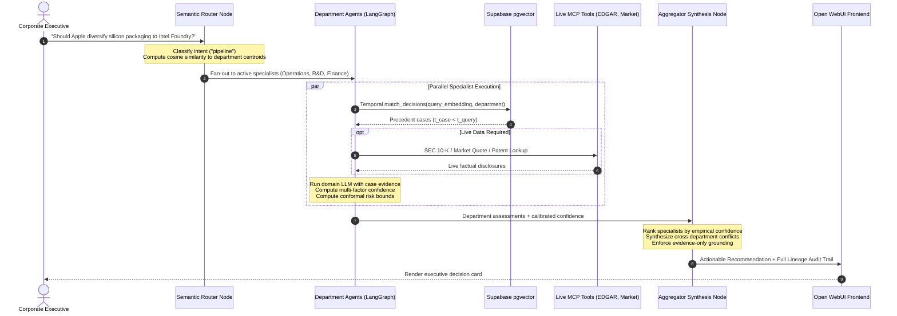

# MARS — Multi-Agent Reasoning System for Corporate Decision Advisory

[](https://www.python.org/downloads/)
[](https://fastapi.tiangolo.com/)
[](https://github.com/langchain-ai/langgraph)
[](https://supabase.com/)
[](evaluation_v2/)

**MARS** is an enterprise-grade multi-agent AI architecture engineered for strategic corporate decision advisory. Rather than relying on naive monolithic prompts or ungrounded generative outputs, MARS coordinates a specialized swarm of department agents (**Finance, Legal, Operations, R&D**) grounded in **2,080 verified historical precedents (2023–2026)**, empirical confidence calibration, and distribution-free conformal risk guarantees.

---

## Table of Contents
1. [Core Innovations & Architecture](#core-innovations--architecture)
2. [End-to-End System Workflow](#end-to-end-system-workflow)
3. [The Specialist Agent Swarm](#the-specialist-agent-swarm)
4. [Empirical Reasoning & Confidence Engine](#empirical-reasoning--confidence-engine)
5. [Repository Structure](#repository-structure)
6. [Configuration & Supported Models](#configuration)
7. [Quick Start Guide](#quick-start-guide)
8. [Database & Embedding Sync](#database--embedding-sync)
9. [Running Tests & Benchmarks](#running-tests--benchmarks)
10. [Documentation & Research Reports](#documentation--research-reports)

---

## Core Innovations & Architecture

```
                 [ Strategic Business Query ]
                              │
                              ▼
┌────────────────────────────────────────────────────────────┐
│  Router Agent: Intent Classification & Semantic MoE Gating │
│  - Distinguishes "pipeline" vs conversational "chat"       │
│  - Embedding-space cosine gating to department centroids   │
│  - Prunes non-essential agents with zero execution cost    │
└─────────────────────────────┬──────────────────────────────┘
                              │
       ┌──────────────────────┼──────────────────────┐
       ▼ (active)             ▼ (active)             ▽ (pruned - 0 overhead)
┌──────────────┐       ┌──────────────┐       ┌──────────────┐
│Finance Agent │       │ Legal Agent  │       │  R&D Agent   │ ...
│- pgvector RAG│       │- pgvector RAG│       │- Fast exit   │
│- MCP Tools   │       │- MCP Tools   │       │- 0 DB / LLM  │
└──────┬───────┘       └──────┬───────┘       └──────────────┘
       │                      │
       └──────────────┬───────┘
                      ▼
┌────────────────────────────────────────────────────────────┐
│  Aggregator Agent: Multi-Factor Synthesis & Governance     │
│  - Ranked by Calibrated Confidence (Sim + Recency + Succ)  │
│  - Conformal Risk Bounds (TW-CRC, α = 0.05)                │
│  - Strict Grounding & Anti-Hallucination Directives        │
└─────────────────────────────┬──────────────────────────────┘
                              │
                              ▼
        [ Actionable Strategic Plan + Lineage Trail ]
```

1. **Semantic Vector Gating Router (Embedding-Space MoE):**
   Encodes queries using `all-MiniLM-L6-v2` and routes via cosine similarity against pre-computed department semantic centroids in $<2\text{ms}$. Pruned agents terminate instantly with zero LLM or database overhead.

2. **Empirical Multi-Factor Confidence Engine:**
   Replaces subjective LLM self-confidence with a mathematically grounded score:
   $$\text{Confidence} = w_1 \cdot \text{Similarity} + w_2 \cdot \text{Recency} + w_3 \cdot \text{PastSuccess}$$
   - **Similarity:** Cosine match of retrieved cases.
   - **Temporal Recency Decay:** Exponential quarterly decay $\exp(-\lambda \Delta q)$ ($\lambda = 0.05$).
   - **Past Success:** Negation-aware outcome classification (*"zero fines"* $\rightarrow$ positive; penalties/delays $\rightarrow$ negative).

3. **Persistent Parameter Registry & Continuous Calibration:**
   Simplex loss optimization over ground-truth outcomes minimizes Binary Cross-Entropy (BCE) loss on historical disclosures without modifying frozen LLM weights. Weights are stored persistently in `backend/app/reasoning/calibrated_weights_registry.json`.

4. **Distribution-Free Conformal Risk Guarantees:**
   Applies inductive conformal prediction (TW-CRC) to calculate finite-sample coverage intervals at significance level $\alpha = 0.05$. Triggers **`ABSTAIN_FOR_HUMAN_REVIEW`** when empirical evidence is sparse or lower bounds fall below safe operational thresholds.

5. **Strict Anti-Hallucination Refusal Guardrail:**
   If all departments retrieve zero precedent cases or report $0.0$ confidence, the aggregator **strictly refuses to fabricate a speculative business plan**. It explicitly alerts management that empirical evidence is absent.

---

## End-to-End System Workflow



---

## The Specialist Agent Swarm

Each department agent is an autonomous, domain-prompted specialist implementing standardized evidence parsing and tool degradation fallbacks:

* **Finance Agent (`finance_agent.py`):** Capital expenditures (CapEx), gross margin dilution, treasury liquidity, share buybacks, and operating cash flow impacts.
* **Legal Agent (`legal_agent.py`):** Regulatory compliance, antitrust scrutiny (DOJ, EU Digital Markets Act), patent infringement risk, and bilateral supplier contract enforceability.
* **R&D Agent (`rd_agent.py`):** Silicon architecture (M-series, A-series), packaging yield tolerances (CoWoS vs EMIB), node shrink feasibility, and firmware efficiency.
* **Operations Agent (`operations_agent.py`):** Supply chain resilience, tier-1 assembler allocations (Foxconn, Pegatron), wafer lead times, and freight logistics.

---

## Empirical Reasoning & Confidence Engine

MARS decouples the **reasoning engine (the frozen LLM)** from the **calibrated scoring policy (the Persistent Parameter Registry)**.

```
┌────────────────────────────────────────────────────────┐
│                   PERSISTENT STORAGE                   │
│         (calibrated_weights_registry.json)             │
│                                                        │
│  • Global Default:  [0.45, 0.20, 0.35]                 │
│  • Domain Profiles: {"legal": [0.42, 0.28, 0.30], ...} │
│  • Action Profiles: {"expand": [0.40, 0.15, 0.45], ...}│
└───────────────────────────┬────────────────────────────┘
                            │ Dynamic Lookup
                            ▼
               ┌────────────────────────┐
               │   Confidence Engine    │ ──▶ Conf = w^T · [Sim, Rec, Succ]
               └────────────┬───────────┘
                            │ Grounded Evidence
                            ▼
               ┌────────────────────────┐
               │ Frozen LLM (Reasoning) │ ──▶ Strategic Advisory Synthesis
               └────────────┬───────────┘
                            │
               [New Outcome Observed / Logged]
                            │
                            ▼
               ┌────────────────────────┐
               │   Continuous Learner   │ ──▶ Minimizes BCE Loss & Persists
               │ (Simplex Optimization) │     Updated Weights to Registry!
               └────────────────────────┘
```

---

## Repository Structure

```
MARS/
├── README.md                            # Master project documentation
├── ArchitectureDiagram.png              # Visual high-level system diagram
├── ARCHITECTURE_CONFIDENCE_AND_ROUTING.md # Detailed architecture & math spec
├── TIER_1_IMPLEMENTATION_AND_BENCHMARKS.md # Benchmark report & empirical findings
├── TIER_1_RESEARCH_PROPOSAL.md          # Theoretical foundations & literature review
├── PEER_REVIEW_ASSESSMENT_AND_RESEARCH_AUDIT.md # Academic assessment & peer audit
├── MARS_SYSTEM_DIAGRAMS_AND_SCHEMAS.md  # Eraser.io & Draw.io Diagram-as-Code
│
├── dataset/                             # Verified 2023-2026 corporate decision corpus
│   ├── decisions.csv                    # 2,080 historical decision records
│   ├── outcomes.csv                     # 2,080 empirical observed outcomes
│   ├── Decisions/                       # Stratified quarterly decision CSVs
│   └── Outcome/                         # Stratified quarterly outcome CSVs
│
├── evaluation/                          # BEIR & G-Eval research benchmark suite
│   ├── run_benchmark.py                 # Retrieval & generation benchmark runner
│   ├── eval_retrieval.py                # Dense vs BM25 vs MMR retrieval eval
│   ├── eval_generation.py               # Frontier LLM judge & ROUGE evaluation
│   ├── benchmark_dataset.py             # Stratified dataset loader
│   └── BENCHMARK_REPORT.md              # Published benchmark findings
│
├── evaluation_v2/                       # Leakage-safe research evaluation suite
│   ├── build_manifests.py               # Chronological manifest generator
│   ├── dataset.py                       # Leakage-safe dataset loader & masking
│   ├── retrieval.py                     # Temporal BM25, Dense & Hybrid benchmark
│   ├── calibration.py                   # Brier, NLL, ECE, & Conformal risk metrics
│   ├── routing.py                       # MoE router precision/recall evaluation
│   ├── research_audit.py                # End-to-end verification audit runner
│   ├── test_protocol.py                 # Temporal boundary integrity unit tests
│   └── test_tool_robustness.py          # Tool failure degradation tests
│
└── backend/                             # Core FastAPI application & reasoning engine
    ├── Dockerfile                       # Production container specification (CPU-torch)
    ├── docker-compose.yml               # Multi-container stack (Backend + Open WebUI)
    ├── pyproject.toml                   # Python dependencies and packaging
    ├── requirements.txt                 # Pinned dependencies
    ├── main.py                          # FastAPI entrypoint & CLI demo
    ├── app/
    │   ├── state.py                     # LangGraph state schema definition
    │   ├── agents/
    │   │   ├── master_agent.py          # LangGraph graph builder & runner
    │   │   ├── router.py                # Intent classifier & dynamic gating node
    │   │   ├── common.py                # Shared agent logic & tool executor
    │   │   ├── finance_agent.py         # Finance department specialist
    │   │   ├── legal_agent.py           # Legal department specialist
    │   │   ├── rd_agent.py              # R&D department specialist
    │   │   ├── operations_agent.py      # Operations department specialist
    │   │   └── chat_agent.py            # Conversational thread fallback node
    │   ├── reasoning/
    │   │   ├── semantic_router.py       # Embedding-Space MoE vector router
    │   │   ├── confidence.py            # Multi-factor confidence & decay engine
    │   │   ├── weight_registry.py       # Thread-safe persistent parameter manager
    │   │   ├── calibrated_weights_registry.json # Calibrated domain weights
    │   │   ├── outcome_analysis.py      # Negation-aware outcome classifier
    │   │   ├── conformal_predictor.py   # Conformal risk controller & policies
    │   │   ├── calibration_metrics.py   # ECE, MCE, NLL, Brier score metrics
    │   │   ├── aggregator.py            # Conflict resolution & executive synthesis
    │   │   └── explainability.py        # Lineage audit trail generator
    │   ├── api/
    │   │   ├── routes.py                # Native API endpoints (/api/query)
    │   │   └── openai_compat.py         # OpenAI-compatible API for Open WebUI (/v1/*)
    │   ├── services/
    │   │   ├── supabase_client.py       # Supabase client & pgvector RPC bindings
    │   │   └── case_retrieval_service.py # Case retrieval & MMR reranking
    │   ├── storage/
    │   │   ├── embedder.py              # Embedding utility functions
    │   │   └── sync_decisions_to_supabase.py # Ingestion & vector upsert pipeline
    │   └── tools/
    │       ├── tool_registry.py         # Agent-tool permission mappings
    │       └── tool_executor.py         # MCP tool call bridge
    ├── sql/
    │   ├── 001_setup.sql                # Supabase schema, pgvector index & RPC
    │   └── 006_match_decisions_outcome_label.sql # Enhanced similarity search RPC
    ├── evaluation/                      # Longitudinal & MultiCorp benchmark modules
    │   ├── longitudinal_evaluation.py   # 2023-2024 train -> 2025-2026 test backtest
    │   ├── multicorp_benchmark.py       # MultiCorp-QA 4-sector cross-domain eval
    │   └── statistical_significance.py  # Paired Bootstrap & Fleiss' Kappa
    └── tests/
        ├── test_confidence_reasoning.py # Automated reasoning test suite (9 tests)
        ├── run_tier1_benchmarks.py      # Master empirical research verification
        ├── tier1_evaluation_results.json # Verified output data
        └── validation_results.json      # Validation benchmarks
```

---

## Configuration

All configuration is centralized in `backend/app/core/config.py` and loaded from `backend/.env`.

```env
# Required for Vector Database & Cases Storage
SUPABASE_URL=https://your-project.supabase.co
SUPABASE_KEY=your_service_role_key

# Model Providers (configure whichever you use)
GROQ_API_KEY=your_groq_api_key
GEMINI_API_KEY=your_gemini_api_key
OPENAI_API_KEY=your_openai_api_key
ANTHROPIC_API_KEY=your_anthropic_api_key

# Optional Search Tools
TAVILY_API_KEY=your_tavily_api_key       # Enables live market, legal, and supply-chain web search
```

### Supported Models
MARS supports dynamic runtime model switching via LangChain `init_chat_model()`:
- `ollama:qwen2.5:3b` *(default — runs locally at zero inference cost)*
- `google_genai:gemini-3.8-flash`
- `groq:qwen/qwen3.8-27b`
- `groq:openai/gpt-oss-120b`
- `groq:openai/gpt-oss-20b`

---

## Quick Start Guide

### Option 1: Docker Compose (Recommended)
Launches both the MARS FastAPI backend and Open WebUI in isolated containers:

```bash
cd backend
cp .env.example .env   # Fill in API keys
docker compose up --build
```

Access points:
| Service | URL | Purpose |
|---|---|---|
| **Open WebUI** | `http://localhost:3000` | Chat UI (`WEBUI_AUTH=false` pre-set) |
| **MARS Backend** | `http://localhost:8000` | Native REST API (`/api/*`) + OpenAI-compatible API (`/v1/*`) |
| **Swagger Docs** | `http://localhost:8000/docs` | Interactive OpenAPI documentation |

### Option 2: Native Local Development

```bash
cd backend
python -m venv .venv
source .venv/bin/activate
pip install -r requirements.txt
cp .env.example .env   # Configure environment variables

# Run FastAPI backend with live reload
uvicorn main:app --reload --port 8000
```

---

## Database & Embedding Sync

MARS utilizes Supabase as its source of truth and vector database via `pgvector`:

1. **Database Setup:**  
   In your Supabase SQL Editor, run:
   - `backend/sql/001_setup.sql` — Enables `vector`, creates `decisions` and `outcomes` tables, triggers, and similarity search RPC.
   - `backend/sql/006_match_decisions_outcome_label.sql` — Configures enhanced similarity search with outcome labels.

2. **Ingest & Embed Historical Precedents:**  
   Run the sync pipeline to embed all 2,080 cases and upload them to Supabase:
   ```bash
   PYTHONPATH=backend python backend/app/storage/sync_decisions_to_supabase.py
   ```

---

## Running Tests & Benchmarks

### 1. Confidence & Reasoning Unit Tests (9 Tests)
Validates multi-factor confidence, recency decay, outcome classification, dynamic skipping, and registry persistence:
```bash
PYTHONPATH=backend python -m unittest backend/tests/test_confidence_reasoning.py
```

### 2. Tier-1 Master Empirical Research Suite
Runs longitudinal backtesting (2023–2024 train $\rightarrow$ 2025–2026 test, $N=2,080$), Conformal Risk bounds, MultiCorp-QA 4-sector evaluation, and Bootstrap significance testing:
```bash
PYTHONPATH=backend python backend/tests/run_tier1_benchmarks.py
```

### 3. Leakage-Safe Research Evaluation (`evaluation_v2`)
Validates temporal boundaries, absence of lookahead bias, and tool failure degradation:
```bash
pytest -v evaluation_v2/test_protocol.py evaluation_v2/test_tool_robustness.py
python -m evaluation_v2.research_audit
```

### 4. BEIR & G-Eval Retrieval & Generation Benchmarks
```bash
python -m evaluation.run_benchmark
```

---

## Documentation & Research Reports

* [ARCHITECTURE_CONFIDENCE_AND_ROUTING.md](ARCHITECTURE_CONFIDENCE_AND_ROUTING.md) — Comprehensive technical architecture, mathematical formulations, and dynamic router design.
* [TIER_1_IMPLEMENTATION_AND_BENCHMARKS.md](TIER_1_IMPLEMENTATION_AND_BENCHMARKS.md) — Full academic benchmark report across Conformal Risk, Longitudinal Backtesting, and MultiCorp-QA.
* [TIER_1_RESEARCH_PROPOSAL.md](TIER_1_RESEARCH_PROPOSAL.md) — Theoretical foundations and literature grounding (Angelopoulos & Bates, Gibbs & Candès, Guo et al.).
* [PEER_REVIEW_ASSESSMENT_AND_RESEARCH_AUDIT.md](PEER_REVIEW_ASSESSMENT_AND_RESEARCH_AUDIT.md) — Formal academic assessment report.
* [MARS_SYSTEM_DIAGRAMS_AND_SCHEMAS.md](MARS_SYSTEM_DIAGRAMS_AND_SCHEMAS.md) — Formal UML Class, Sequence, and Deployment diagram specifications for Eraser.io and Draw.io.
