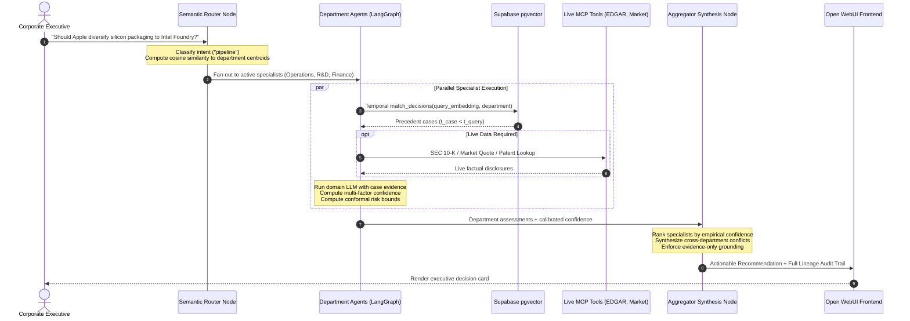

# MARS — Multi-Agent Reasoning System for Corporate Decision Advisory

[](https://www.python.org/downloads/)
[](https://fastapi.tiangolo.com/)
[](https://github.com/langchain-ai/langgraph)
[](https://supabase.com/)
[](evaluation_v2/)

**MARS** is an enterprise-grade multi-agent AI architecture engineered for strategic corporate decision advisory. Rather than relying on naive monolithic prompts or ungrounded generative outputs, MARS coordinates a specialized swarm of department agents (**Finance, Legal, Operations, R&D**) grounded in **2,080 verified historical precedents (2023–2026)**, empirical confidence calibration, and distribution-free conformal risk guarantees.

---

## Table of Contents
1. [Core Innovations & Architecture](#core-innovations--architecture)
2. [End-to-End System Workflow](#end-to-end-system-workflow)
3. [The Specialist Agent Swarm](#the-specialist-agent-swarm)
4. [Empirical Reasoning & Confidence Engine](#empirical-reasoning--confidence-engine)
5. [Leakage-Safe Research Evaluation (`evaluation_v2`)](#leakage-safe-research-evaluation-evaluation_v2)
6. [Repository Structure](#repository-structure)
7. [Quick Start Guide](#quick-start-guide)
8. [Database & Embedding Sync](#database--embedding-sync)
9. [Running Tests](#running-tests)

---

## Core Innovations & Architecture

```
                 [ Strategic Business Query ]
                              │
                              ▼
┌────────────────────────────────────────────────────────────┐
│  Router Agent: Intent Classification & Semantic MoE Gating │
│  - Distinguishes "pipeline" vs conversational "chat"       │
│  - Embedding-space cosine gating to department centroids   │
│  - Prunes non-essential agents with zero execution cost    │
└─────────────────────────────┬──────────────────────────────┘
                              │
       ┌──────────────────────┼──────────────────────┐
       ▼                      ▼                      ▼
┌──────────────┐       ┌──────────────┐       ┌──────────────┐
│Finance Agent │       │ Legal Agent  │       │  R&D Agent   │  (Operations pruned
└──────┬───────┘       └──────┬───────┘       └──────┬───────┘   if not required)
       │                      │                      │
       ├──────────────────────┴──────────────────────┤
       │  Per-Agent Evidence & Calibrated Grounding: │
       │  1. Temporal pgvector Retrieval (t < now)   │
       │  2. Live MCP Tool Execution & Fallbacks     │
       │  3. Multi-Factor Confidence Scoring         │
       │  4. Conformal Risk Bounds [L, U]            │
       └──────────────────────┬──────────────────────┘
                              │
                              ▼
┌────────────────────────────────────────────────────────────┐
│      Aggregator Agent: Executive Synthesis & Audit         │
│  - Ranks departments by calibrated case confidence         │
│  - Resolves cross-department tensions & strategic trade-offs│
│  - Enforces strict anti-hallucination refusal guardrails   │
└─────────────────────────────┬──────────────────────────────┘
                              │
                              ▼
        [ Grounded Strategic Recommendation & Audit Trail ]
```

1. **Embedding-Space Semantic Vector Gating (Sub-10ms MoE Router):**
   Queries are embedded and mapped against normalized department prototype centroids. Using dual gating (cosine similarity threshold $\ge 0.32$ and relative margin ratio $\ge 0.70$), MARS dynamically activates only the relevant specialists, achieving an estimated **~74.5% reduction in agent invocations** while preserving cross-functional governance.

2. **Empirical Case-Based Confidence Scoring:**
   MARS replaces ungrounded LLM self-reported confidence with an objective multi-factor score:
   $$\text{Confidence} = w_{\text{sim}} \cdot \bar{S} + w_{\text{rec}} \cdot e^{-\lambda \Delta t} + w_{\text{succ}} \cdot P(\text{Success})$$
   - $\bar{S}$: Mean cosine similarity of retrieved precedent cases.
   - $e^{-\lambda \Delta t}$: Exponential temporal decay ($\lambda = 0.05/\text{quarter}$), penalizing stale precedents.
   - $P(\text{Success})$: Historical empirical success rate of prior analogous decisions, classified using a negation-aware corporate outcome parser.

3. **Domain-Specific Calibrated Weight Registry:**
   Weights are persisted on disk (`calibrated_weights_registry.json`) and tailored to domain characteristics:
   - **Legal:** High recency weighting ($w_{\text{rec}} = 0.28\text{--}0.40$) to reflect shifting regulatory frameworks (EU DMA, antitrust).
   - **R&D:** High similarity weighting ($w_{\text{sim}} = 0.55$) to enforce exact technical/architectural parity.
   - **Finance:** High historical outcome weighting ($w_{\text{succ}} = 0.45$) prioritizing proven ROI and margin preservation.
   - **Operations:** Balanced weighting across logistics feasibility and fulfillment success.

4. **Distribution-Free Conformal Risk Guarantees:**
   Applies inductive conformal prediction to calculate finite-sample coverage intervals $[L_i, U_i]$ at significance level $\alpha = 0.05$. Scores map deterministically to governance policies:
   - **Autonomous Execution (`PROCEED_AUTONOMOUS`):** Tight interval with high lower bound.
   - **Human Escalation (`ABSTAIN_FOR_HUMAN_REVIEW`):** Wide intervals or low evidence lower bounds trigger mandatory board review.

5. **Strict Anti-Hallucination Refusal Guardrail:**
   If all departments retrieve zero precedent cases or report $0.0$ confidence, the aggregator **strictly refuses to fabricate a speculative business plan**. It explicitly alerts management that empirical evidence is absent.

---

## End-to-End System Workflow



---

## The Specialist Agent Swarm

Each department agent is an autonomous, domain-prompted specialist implementing standardized evidence parsing and tool degradation fallbacks:

* **Finance Agent (`finance_agent.py`):** Capital expenditures (CapEx), gross margin dilution, treasury liquidity, share buybacks, and operating cash flow impacts.
* **Legal Agent (`legal_agent.py`):** Regulatory compliance, antitrust scrutiny (DOJ, EU Digital Markets Act), patent infringement risk, and bilateral supplier contract enforceability.
* **R&D Agent (`rd_agent.py`):** Silicon architecture (M-series, A-series), packaging yield tolerances (CoWoS vs EMIB), node shrink feasibility, and firmware efficiency.
* **Operations Agent (`operations_agent.py`):** Supply chain resilience, tier-1 assembler allocations (Foxconn, Pegatron), wafer lead times, and freight logistics.

---

## Leakage-Safe Research Evaluation (`evaluation_v2`)

Earlier iterations of corporate retrieval benchmarks suffered from well-known evaluation pitfalls: self-case retrieval, future outcome lookahead, and simulated metrics. 

The `evaluation_v2/` package implements a **strictly defensible scientific benchmark protocol**:

1. **Strict Chronological Invariants:**
   - Precedents are restricted to strictly prior dates: $\text{decision\_date}_{\text{precedent}} < \text{decision\_date}_{\text{query}}$.
   - Outcomes are masked unless verified prior to the query date: $\text{observation\_date} \le \text{decision\_date}_{\text{query}}$.
   - Query cases are explicitly masked by `case_id` to prevent self-retrieval.
2. **Fixed Split Manifest:**
   - **Train Split:** 1,280 cases (2023 Q1 – 2024 Q4)
   - **Validation Split:** 320 cases (2025 Q1 – 2025 Q2)
   - **Test Split:** 480 cases (2025 Q3 – 2026 Q1)
   - *Total:* 2,080 verified cases across 13 quarters.
3. **Reproducibility Suite:**
   - Automated research audit: `python -m evaluation_v2.research_audit`
   - Unit validation tests: `pytest evaluation_v2/test_protocol.py evaluation_v2/test_tool_robustness.py`

---

## Repository Structure

```
MARS/
├── README.md                            # Authoritative master project documentation
├── ArchitectureDiagram.png              # Visual high-level system diagram
├── dataset/                             # Verified 2023-2026 corporate decision corpus
│   ├── decisions.csv                    # 2,080 historical decision records
│   ├── outcomes.csv                     # 2,080 empirical observed outcomes
│   ├── Decisions/                       # Per-quarter breakdown CSVs
│   └── Outcome/                         # Per-quarter outcome CSVs
├── evaluation_v2/                       # Leakage-safe research evaluation suite
│   ├── build_manifests.py               # Chronological manifest generator
│   ├── dataset.py                       # Leakage-safe dataset loader & masking
│   ├── retrieval.py                     # Temporal BM25, Dense & Hybrid benchmark
│   ├── calibration.py                   # Brier, NLL, ECE, & Conformal risk metrics
│   ├── routing.py                       # MoE router precision/recall evaluation
│   ├── replay.py                        # Replay packet generator & scoring template
│   ├── research_audit.py                # End-to-end verification audit runner
│   ├── test_protocol.py                 # Protocol & temporal integrity unit tests
│   ├── test_tool_robustness.py          # Tool failure degradation tests
│   ├── EXPERIMENT_PLAN.md               # Scientific hypotheses & experiment matrix
│   └── artifacts/                       # Verified JSON evaluation runs
├── backend/                             # Core FastAPI application & reasoning engine
│   ├── Dockerfile                       # Production container specification (CPU-torch)
│   ├── docker-compose.yml               # Multi-container stack (Backend + Open WebUI)
│   ├── pyproject.toml                   # Python dependencies and packaging
│   ├── requirements.txt                 # Pinned dependencies
│   ├── app/
│   │   ├── main.py                      # FastAPI application entrypoint
│   │   ├── state.py                     # LangGraph state schema definition
│   │   ├── agents/
│   │   │   ├── master_agent.py          # LangGraph graph builder & runner
│   │   │   ├── router.py                # Intent classifier & dynamic gating node
│   │   │   ├── common.py                # Shared agent logic & tool executor
│   │   │   ├── finance_agent.py         # Finance department specialist
│   │   │   ├── legal_agent.py           # Legal department specialist
│   │   │   ├── rd_agent.py              # R&D department specialist
│   │   │   ├── operations_agent.py      # Operations department specialist
│   │   │   └── chat_agent.py            # Conversational thread fallback node
│   │   ├── reasoning/
│   │   │   ├── semantic_router.py       # Embedding-Space MoE vector router
│   │   │   ├── confidence.py            # Multi-factor confidence & decay engine
│   │   │   ├── weight_registry.py       # Thread-safe persistent parameter manager
│   │   │   ├── calibrated_weights_registry.json # Calibrated domain weights
│   │   │   ├── outcome_analysis.py      # Negation-aware outcome classifier
│   │   │   ├── conformal_predictor.py   # Conformal risk controller & policies
│   │   │   ├── calibration_metrics.py   # ECE, MCE, NLL, Brier score metrics
│   │   │   ├── aggregator.py            # Conflict resolution & executive synthesis
│   │   │   └── explainability.py        # Lineage audit trail generator
│   │   ├── api/
│   │   │   ├── routes.py                # Native API endpoints (/api/query)
│   │   │   └── openai_compat.py         # OpenAI-compatible API for Open WebUI (/v1/*)
│   │   ├── services/
│   │   │   ├── supabase_client.py       # Supabase client & pgvector RPC bindings
│   │   │   └── embedding.py             # Sentence-transformers embedding service
│   │   ├── storage/
│   │   │   ├── embedder.py              # Embedding utility functions
│   │   │   └── sync_decisions_to_supabase.py # Ingestion & vector upsert pipeline
│   │   └── tools/
│   │       ├── tool_registry.py         # Agent-tool permission mappings
│   │       ├── edgar_tool.py            # SEC EDGAR 10-K financial disclosures
│   │       └── search_tool.py           # Live market & patent queries
│   ├── sql/
│   │   └── 001_setup.sql                # Supabase schema, pgvector index & RPC
│   └── tests/
│       ├── test_confidence_reasoning.py # Automated reasoning test suite
│       └── comprehensive_evaluation.py  # 7-section diagnostic harness
```

---

## Quick Start Guide

### Option 1: Docker Compose (Recommended)
This launches both the MARS FastAPI backend and the Open WebUI frontend in isolated containers:

```bash
cd backend
cp .env.example .env
# Edit .env with your GROQ_API_KEY, SUPABASE_URL, and SUPABASE_KEY
docker compose up --build
```

Access the interfaces:
* **Open WebUI Chat Interface:** `http://localhost:3000`
* **MARS Backend API:** `http://localhost:8000`
* **API Documentation (Swagger):** `http://localhost:8000/docs`

### Option 2: Native Local Development

```bash
# From the repository root
cd backend
python -m venv .venv
source .venv/bin/activate
pip install -r requirements.txt

cp .env.example .env
# Fill in API keys in .env

# Run FastAPI with live reload
uvicorn app.main:app --reload --port 8000
```

---

## Database & Embedding Sync

MARS uses **Supabase with `pgvector`** for precedent retrieval.

1. **Database Initialization:**  
   Execute [backend/sql/001_setup.sql](backend/sql/001_setup.sql) in the Supabase SQL Editor. This sets up:
   * The `decisions` table with vector column `embedding vector(384)`.
   * The `outcomes` table linked via `case_id`.
   * The `match_decisions` similarity-search RPC function.

2. **Ingest & Embed Historical Precedents:**  
   Run the sync pipeline to embed all 2,080 cases and upload them to Supabase:
   ```bash
   PYTHONPATH=backend python backend/app/storage/sync_decisions_to_supabase.py
   ```

---

## Running Tests

### 1. Confidence & Reasoning Unit Tests
Validates the multi-factor confidence engine, negation classification, weight registry, and dynamic router:
```bash
PYTHONPATH=backend pytest -v backend/tests/test_confidence_reasoning.py
```

### 2. Leakage-Safe Evaluation Protocol Tests
Validates temporal boundaries, absence of lookahead bias, and tool failure degradation:
```bash
pytest -v evaluation_v2/test_protocol.py evaluation_v2/test_tool_robustness.py
```

### 3. Full Research Audit
Executes the comprehensive verification pipeline across manifest integrity, temporal retrieval, calibration, and router efficiency:
```bash
python -m evaluation_v2.research_audit
```
Results will be output directly to `evaluation_v2/artifacts/research_audit_summary.json`.

---

## License & Attribution
Developed for enterprise corporate advisory research. Built with LangGraph, pgvector, and FastAPI.
